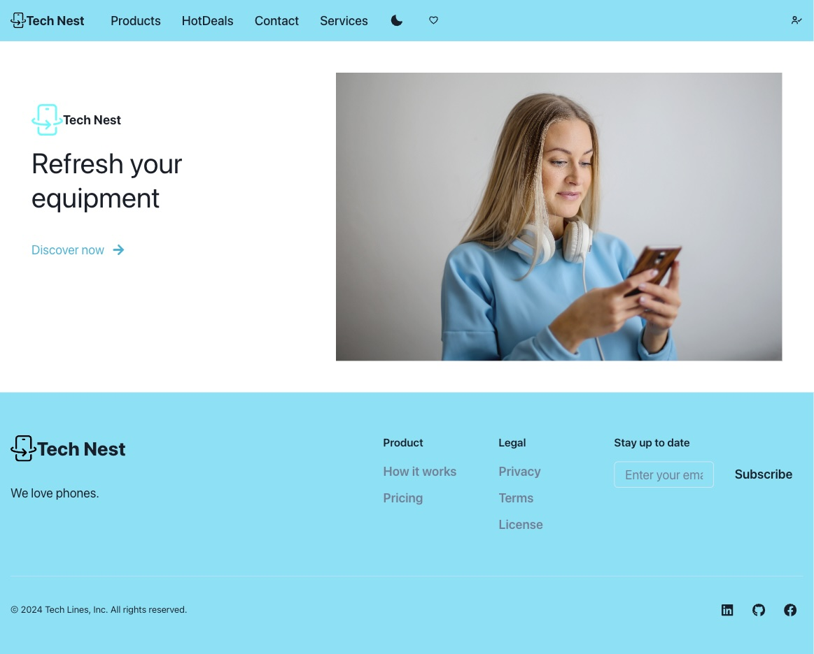
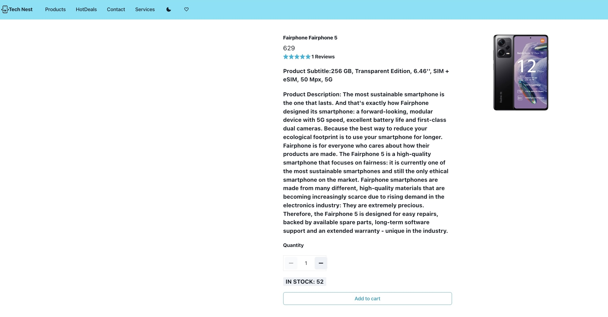

# Tech Nest - MERN Stack E-commerce Platform

Tech Nest is a full-stack e-commerce platform built using the MERN (MongoDB, Express, React, Node.js) stack. This project is designed to provide a seamless shopping experience for users, featuring a modern frontend, a robust backend, and a secure payment gateway integration.

## Table of Contents

- [Features](#features)
- [Screenshots](#screenshots)
- [Installation](#installation)
- [Dependencies](#dependencies)
- [Database Design](#database-design)
- [Future Implementations](#future-implementations)
- [Author](#author)
- [Contact](#contact)

## Features

- User authentication and authorization (JWT)
- Product management (CRUD operations)
- Shopping cart functionality
- Secure checkout process
- Payment gateway integration (Stripe)
- Order management for users and admins
- Responsive design for a seamless mobile experience

## Screenshots





## Installation

To run this project locally, follow these steps:

1. **Clone the repository:**
   ```bash
   git clone https://github.com/AlejandraValdivia/tech-nest.git
   cd tech-nest

2. **Install backend dependencies:**

cd backend
npm install

3. **Install frontend dependencies:**

cd client
npm install

4. Set up environment variables:

Create a .env file in the root of both the backend and frontend directories and add the necessary environment variables:

Backend .env:
PORT=3000
MONGO_URI=your_mongo_database_uri
JWT_SECRET=your_jwt_secret
STRIPE_SECRET_KEY=your_stripe_secret_key

Frontend .env:
REACT_APP_BACKEND_URL=http://localhost:3000/api

5. **Run backend and frontend:**

cd server
npm start

cd client
npm start

or run both concurrently:

cd to the tech-nest folder

npm run dev

The application will be running at http://localhost:3001.

## Dependencies ##

Backend dependencies:
- [bcryptjs](https://www.npmjs.com/package/bcryptjs) - for hashing passwords
- [cors](https://www.npmjs.com/package/cors) - for handling CORS requests
- [dotenv](https://www.npmjs.com/package/dotenv) - for loading environment variables
- [express](https://www.npmjs.com/package/express) - for building server
- [jsonwebtoken](https://www.npmjs.com/package/jsonwebtoken) - for generating JWT tokens
- [mongoose](https://www.npmjs.com/package/mongoose) - for working with MongoDB
- [stripe](https://stripe.com/docs/api) - for handling payments with Stripe


Frontend dependencies:
- [react](https://www.npmjs.com/package/react) - for building frontend
- [react-dom](https://www.npmjs.com/package/react-dom) - for rendering frontend
- [react-router-dom](https://www.npmjs.com/package/react-router-dom) - for routing
- [react-redux](https://www.npmjs.com/package/react-redux) - for state management
- [react-redux-toolkit](https://www.npmjs.com/package/react-redux-toolkit) - for state management
- [chackra-ui](https://www.npmjs.com/package/chackra-ui) - for styling
- [axios](https://www.npmjs.com/package/axios) - for making HTTP requests

## Database Design ##

Products:

- name
- description
- price
- image
- category
- rating
- numReviews
- countInStock

Users:

- name
- email
- password
- isAdmin

Orders:

- user
- orderItems
- shippingAddress
- paymentMethod
- itemsPrice
- taxPrice
- shippingPrice
- totalPrice
- isPaid
- paidAt
- isDelivered
- deliveredAt

## Future Implementations ##
Admin Dashboard: Advanced analytics and management tools for admin users.
Product Recommendations: Personalized product recommendations based on user behavior.
Wishlist Feature: Allow users to save products to a wishlist for later purchase.
Multi-language Support: Support for multiple languages to cater to a global audience.

## Author ##

Alejandra Valdivia

GitHub: https://github.com/AlejandraValdivia 
LinkedIn: https://www.linkedin.com/in/alejandra-valdivia/